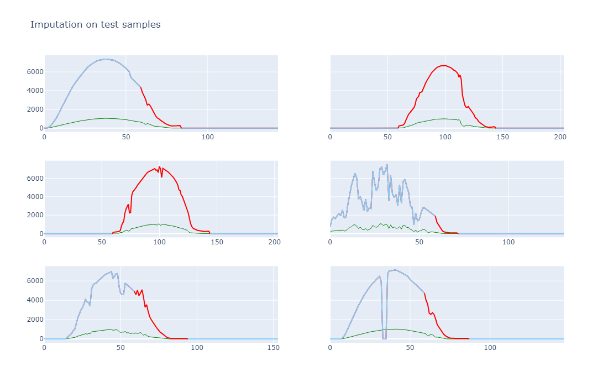
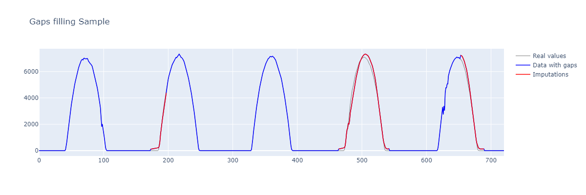
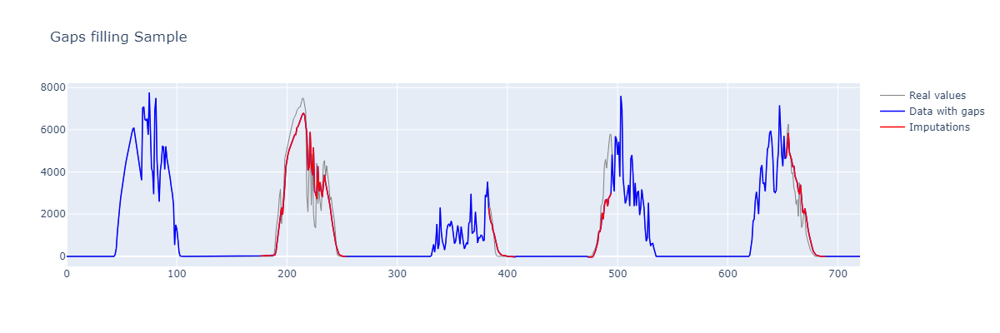

# PV-Gap-Filling

Gap filling for power generation time series data of PV (Photovoltaic) systems.

1. Clone or download this repository to your local machine.
2. Install the required dependencies.
3. Run the script using the following command:
```
python source/impute.py path_to_meteo_data.csv path_to_pv_data.csv output_path.csv
```
Replace `path_to_meteo_data.csv`, `path_to_pv_data.csv`, and `output_path.csv` with the actual file paths you want to use.

------------------------
### Example
Suppose you have the following CSV files:

- meteo_data.csv containing meteorological data.
- pv_data.csv containing photovoltaic (PV) data.

To fill gaps in the PV power generation time series you can run the following command:
```
python source/impute.py data/meteo_data.csv data/pv_data.csv saves/df_imputed.csv
```

----------------------
### Examples of the ipmutation

<p align="center"></p>

<p align="center"></p>

<p align="center"></p>
