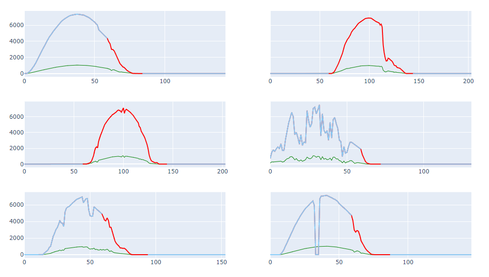
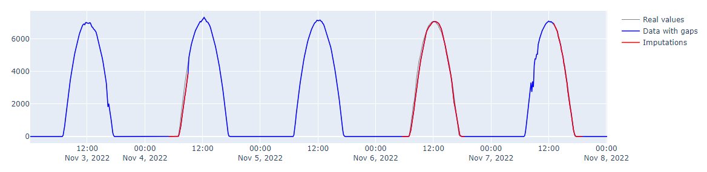
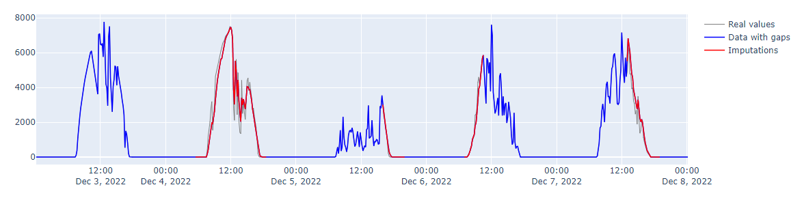

# PV-Gap-Filling

Gap filling for power generation time series data of PV (Photovoltaic) systems.

1. Clone or download this repository to your local machine.
2. Install the required dependencies.
```bash
pip install -r requirements.txt
```
3. Move to root directory and run the script using the following command:
```bash
python source/impute.py path_to_meteo_data.csv path_to_pv_data.csv output_path.csv model
```
Replace `path_to_meteo_data.csv`, `path_to_pv_data.csv`, and `output_path.csv` with the actual file paths you want to use.
  
Choose the gap filling method by replacing model with `'xgb'` or `'lstm'`.

> If model is not specified `'xgb'` will be used.

> Note that the xgb model performs best.

------------------------
## Example
***test-data*** directory contains the meteo data and PV data of December 2022 collected at [GEP](https://www.greenenergypark.ma). These datasets can be utilized for testing as follows:

[//]: # (To fill gaps in the PV power generation time series with the Gradient Boosting regression model you can run the following command:)
```
python source/impute.py test-data/meteo_data_12_22.csv test-data/System_117_12_22.csv saves/df_imputed.csv 'xgb'
```

----------------------
## Examples of the imputation

[//]: # (<p align="center"></p>)

<p align="center"></p>

<p align="center"></p>

---------------------
## Acknowledgments
### [Green Energy Park](https://www.greenenergypark.ma)
